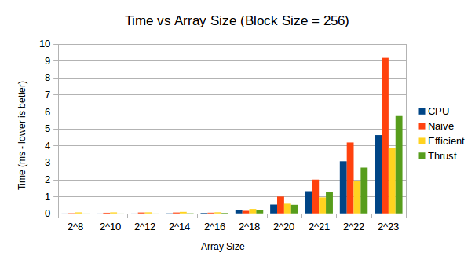
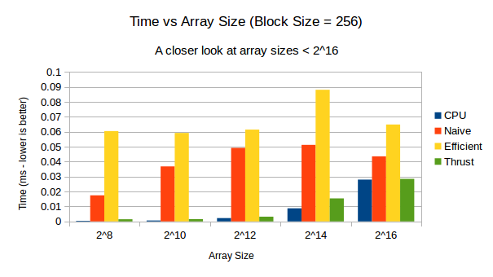
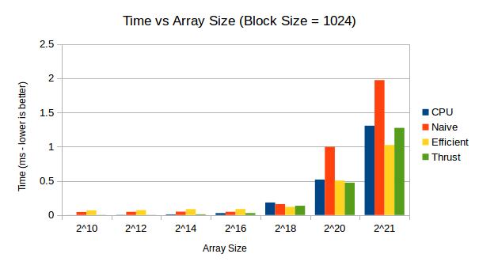
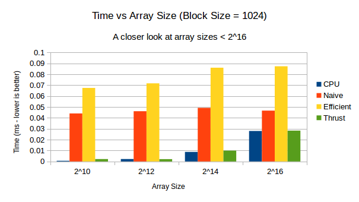

CUDA Stream Compaction
======================

**University of Pennsylvania, CIS 565: GPU Programming and Architecture, Project 2**

* Edward Atter
  * [LinkedIn](https://www.linkedin.com/in/atter/)
  * Tested on: Linux Mint 18.3 Sylvia (4.13.0-41-generic), Ryzen 7 2700x @ 3.7 ghz (base clock) 16GB, GTX 1070 TI 8GB GDDR5 (Personal)
  * CUDA 9

## Overview

This project implements array scanning and stream compaction. Below are some diagrams from GPU Gems.

Compaction is useful to reduce the size if only the true values matter. Think of sparse arrays or only considering object collisions. 

## Performance

#### Methodology

Memory operations such as `malloc` or `memset` were excluded from the results. In the case of compaction, only the final step (scatter) is timed. Any preliminary data formatting (for example to get the boolean array or scanning to get the proper indices) is not included in the time. Unless otherwise stated, a block size of 1024 was used throughout the analysis. 

The timing data displayed below is an average across two runs. Ideally, there would be a much higher number of trials, though in practice the timings did not change much. 

#### Analysis

Large block sizes perform the best. This is likely because each thread does very little work. Specifically, a block size of 1024 was chosen. See the graphs below for a comparison.

 

 

With the exception of thrust, both GPU implementations improve relative to the CPU as the array size increases. The naive solution is never worth using, as it is always the slowest. When the array size grows extremely large, the efficient implementation beats even the standard thrust library. Any performance bottlenecks are IO related. It can be improved significantly by using shared instead of global memory within blocks. 

It should be noted that thrust is really at an unfair advantage in these tests. Memory allocations are not included in the performance tests for any of the custom built solutions. The timing for thrust, however, includes all the necessary memory allocations. 

On examination, in addition to watching `top` and `nvidia-smi`, I believe thrust uses the CPU for small array sizes, and switches to utilizing the GPU when the array size reaches a sufficient length. 

## Program Output

    ****************
    ** SCAN TESTS **
    ****************
        [  40  41   8  46   3  10  25  38  24  42  12  31  35 ...  16   0 ]
    ==== cpu scan, power-of-two ====
       elapsed time: 0.14779ms    (std::chrono Measured)
        [   0  40  81  89 135 138 148 173 211 235 277 289 320 ... 6428057 6428073 ]
    ==== cpu scan, non-power-of-two ====
       elapsed time: 0.14218ms    (std::chrono Measured)
        [   0  40  81  89 135 138 148 173 211 235 277 289 320 ... 6427957 6427981 ]
        passed 
    ==== naive scan, power-of-two ====
       elapsed time: 0.163936ms    (CUDA Measured)
        passed 
    ==== naive scan, non-power-of-two ====
       elapsed time: 0.109696ms    (CUDA Measured)
        passed 
    ==== work-efficient scan, power-of-two ====
       elapsed time: 0.131392ms    (CUDA Measured)
        passed 
    ==== work-efficient scan, non-power-of-two ====
       elapsed time: 0.119008ms    (CUDA Measured)
        passed 
    ==== thrust scan, power-of-two ====
       elapsed time: 0.221088ms    (CUDA Measured)
        passed 
    ==== thrust scan, non-power-of-two ====
       elapsed time: 0.22096ms    (CUDA Measured)
        passed 

    *****************************
    ** STREAM COMPACTION TESTS **
    *****************************
        [   2   1   0   2   1   2   1   2   2   2   0   1   1 ...   0   0 ]
    ==== cpu compact without scan, power-of-two ====
       elapsed time: 1.05048ms    (std::chrono Measured)
        [   2   1   2   1   2   1   2   2   2   1   1   3   3 ...   3   3 ]
        passed 
    ==== cpu compact without scan, non-power-of-two ====
       elapsed time: 1.05846ms    (std::chrono Measured)
        [   2   1   2   1   2   1   2   2   2   1   1   3   3 ...   2   3 ]
        passed 
    ==== cpu compact with scan ====
       elapsed time: 1.09453ms    (std::chrono Measured)
        [   2   1   2   1   2   1   2   2   2   1   1   3   3 ...   3   3 ]
        passed 
    ==== work-efficient compact, power-of-two ====
       elapsed time: 0.022336ms    (CUDA Measured)
        passed 
    ==== work-efficient compact, non-power-of-two ====
       elapsed time: 0.024768ms    (CUDA Measured)
        passed  
